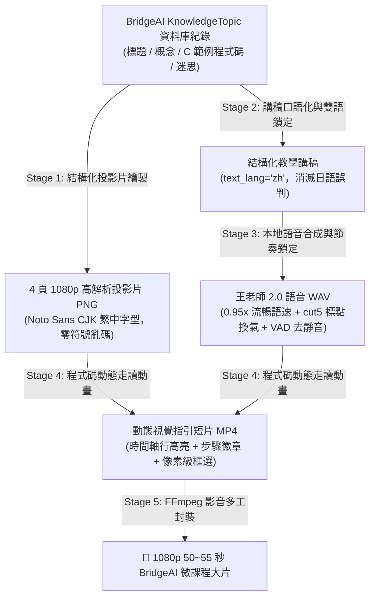

# BridgeAI 知識點微課程「全自動影音生產引擎」標準化規格書
*(BridgeAI Automated Topic Video Engine Specification)*

> **版本**：v2.0 (Verified Standard)  
> **更新日期**：2026-08-19  
> **狀態**：正式確立為 BridgeAI 知識點微課程自動化生產標準 (Standardized Production Blueprint)

---

## 一、 核心設計定位與價值

BridgeAI 的知識點（`KnowledgeTopic`）包含標題、Markdown 教材、學習目標、常見迷思與程式碼範例。
本引擎能將任何一個知識點，在 **45 秒內全自動轉化為 1080p 50~55 秒的高品質「王老師動態微課程教學影片」**，直接掛載至系統前端供學生觀看。

---

## 二、 全自動化影音生產五大標準階段 (5-Stage Standard Pipeline)

---

## 三、 各階段技術標準與防錯規範 (Fail-Safe Rules)

### Stage 1：投影片視覺排版規範
* **字型規範**：一律使用 `Noto Sans CJK TC (Bold/Regular)`，嚴禁使用無 CJK 字符的純英文字型，確保 C 語言程式碼中的中文字串（如 `printf("學生: %s\n")`）與特殊符號 100% 正常顯示。
* **標準 4 頁微課程架構**：
  1. **Slide 1（開場與痛點 Hook）**：提出問題與情境痛點 $\rightarrow$ 帶出核心主題。
  2. **Slide 2（核心語法觀念）**：生活化比喻 $\rightarrow$ 語法架構拆解。
  3. **Slide 3（程式碼實戰走讀）**：深色高亮 Code Block 走讀。
  4. **Slide 4（常見迷思與課堂總結）**：新手最常踩的坑警示 $\rightarrow$ 總結收尾。

---

### Stage 2：講稿正規化與雙語模式鎖定
* **語言鎖定**：**強制指定 `text_lang = "zh"`**，嚴禁使用 `auto` 多語偵測（避免中文漢字「點」、「微課程」、「定義」、「完成」被 `LangSegmenter` 誤判為日文 Kanji 並呼叫日語發音引擎）。
* **中英邊界隔離**：英文單字（如 `struct`、`Student`、`compile`）前後一律加空格或逗號隔離，避免 BERT 分詞器黏滯吞音。
* **程式變數口語化**：將 `s1`、`printf` 轉換為自然口播詞（如 `宣告第一個學生變數`、`印出結果`）。
* **流暢呼吸斷句**：移除瑣碎逗號，維持每句 8~15 字的自然人聲語調。

---

### Stage 3：語音合成與節奏標準參數
* **聲學模型**：王老師 2.0 旗艦版（`wang_teacher_v2_e8_s648.pth` + `wang_teacher_v2-e15.ckpt`）。
* **語速標準**：`speed_factor = 0.95`（告別 0.76x 拖沓慢速，達到自信流暢的自然授課節奏）。
* **斷句切分**：`text_split_method = "cut5"`（依標點符號自適應換氣，杜絕句尾漂移與重複音）。
* **聲波 VAD 自動修齊**：
  * 開場前置（Lead-in）：`0.15 秒`（翻頁即刻發聲，緊湊不拖延）。
  * 結尾收音（Tail）：`0.25 秒`。

---

### Stage 4：程式碼動態走讀動畫規範【關鍵新流程】
* **時間軸精確對齊（Timeline-Aware Overlays）**：
  * 依據語音的時間戳記，在老師講到特定程式碼時，即時啟動視覺引導動畫。
* **像素級邊界包覆（Pixel-Perfect Bounding Boxes）**：
  * 嚴格依據行高基準計算 Y 軸座標與高度，預留 4px 舒適安全間距，絕不可切到相鄰行。
* **通用幾何指引標記**：
  * 標籤文字一律使用標準字符（如 `▶ 步驟 1：定義結構體型態`），嚴禁直接使用 Emoji 圖標（如 `👉`、`🔍`），避免因 Linux 字型缺失出現缺字方塊 `☒`。
* **四色視覺語意階層**：
  * **青藍色（Cyan）**：型態定義 / 結構宣告。
  * **亮綠色（Green）**：實體變數宣告 / 記憶體配置。
  * **金黃色（Gold/Amber）**：成員存取 / 賦值操作。
  * **洋紅色（Magenta）**：函式呼叫 / 執行結果印出。

---

### Stage 5：影音封裝與成果交付
* **解析度與編碼**：1080p (1920x1080) H.264 Baseline/High + 32kHz AAC 192kbps。
* **總時長基準**：4 頁微課程控制在 **50 ~ 55 秒黃金短片長度**，資訊密度適中，完課率最高。
* **本機交付路徑**：
  * 最新 Master 影片：[`/home/pjw92/projects/GPT-SoVITS/output_videos/BridgeAI_Topic_C_Struct_MicroLecture_Wang3.0.mp4`](file:///home/pjw92/projects/GPT-SoVITS/output_videos/BridgeAI_Topic_C_Struct_MicroLecture_Wang3.0.mp4)
  * 管線輸出路徑：[`/home/pjw92/projects/GPT-SoVITS/bridgeai_topic_demo/v3_output/`](file:///home/pjw92/projects/GPT-SoVITS/bridgeai_topic_demo/v3_output/)
